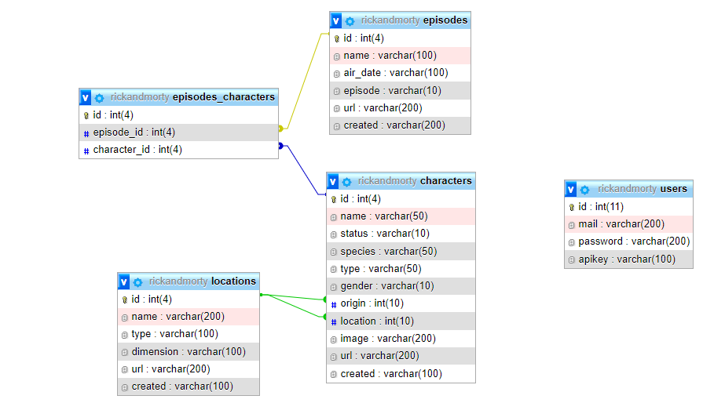

# dwes_examen_4
Durant aquest examen es farà ús de la base de dades que es va emprar durant el primer examen (Rick & Morty) l’objectiu d’aquesta prova, es que sigueu capaços d’implementar una aplicació d’una forma molt més lliure i autònoma tenint en compte que ens trobem al darrer examen del curs i s’espera de vosaltres la creació d’aplicacions de 0 fins al producte final. 
És per aquest motiu que en aquest examen no disposareu d’un desplegament que pugueu consultar, sinó que heu de ser vosaltres qui lliurement haureu de realitzar la vostra aplicació prenent les vostres decisions, donant lloc a exàmens i resultats molt diferents.

La base de dades presenta la següent estructura:

L’aplicació només té un requisit funcional, un usuari ha de poder canviar les ubicacions dels personatges (camp location de la taula characters).

Els requisits tècnics són els següents:
- Consulta a bases de dades.
- Programació orientada a objectes.
- Model-Vista-Controlador
- Separació Front-Back mitjançant una API.
- Ús de sessions.

Es valoraran els següents paràmetres de qualitat de la vostra aplicació:
- Optimització del codi.
- Llegibilitat.
- Nomenclatura.

En cas de no saber implementar algun dels requisits tècnics, es recomana seguir amb el desenvolupament de l’aplicació obviant el requisit, sempre es millor entregar un producte amb manca de requisits que no entregar res.
